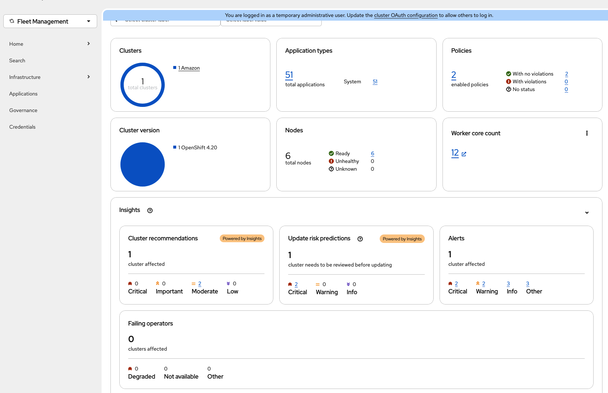

# Insights On Premise (monolithic version)

A Python application that receives Insights archives, processes them with insights-core, and stores results in PostgreSQL. Designed for on-premise deployment in ACM clusters.

## API Endpoints

### Upload Archive
```
POST /api/ingress/v1/upload
```
Upload an Insights archive for processing.

**Example:**
```bash
curl -X POST http://localhost:8000/api/ingress/v1/upload -F "file=@/path/to/archive.tar.gz"
```

### Get Cluster Report
```
GET /api/v2/cluster/{cluster_id}/report
```
Retrieve processed report for a cluster.

### Health Check
```
GET /health
```

### API Documentation
- Swagger UI: http://localhost:8000/docs
- ReDoc: http://localhost:8000/redoc

## Building and Pushing Multiarch Image

Build and push a multiarch (amd64, arm64) image to Quay (this step is necessary because cluster nodes may run on different architecture than the development environment):

```bash
# Login to Quay
docker login quay.io

# Build and push multiarch image
docker buildx build --platform linux/amd64,linux/arm64 \
  -t quay.io/ccxdev/insights-on-premise-poc:latest \
  --push .
```

The image is referenced as `quay.io/ccxdev/insights-on-premise-poc:latest` in `deploy/insights.yml`. This image includes:
- The core on-prem pipeline (archive processing, recommendations, URP via Thanos)
- A batch URP endpoint at `/api/insights-results-aggregator/v2/upgrade-risks-prediction` matching the `ccx-upgrades-data-eng` API format, which allows the ACM console to route URP calls to this service instead of `console.redhat.com` (see [Update risk predictions](#update-risk-predictions) section)

## Running Locally with Docker Compose

1. **Start services:**
   ```bash
   docker-compose up -d
   ```

2. **Run database migrations:**
   ```bash
   docker-compose exec app alembic upgrade head
   ```

3. **Verify:**
   ```bash
   curl http://localhost:8000/health
   ```

4. **View logs:**
   ```bash
   docker-compose logs -f app
   ```

5. **Stop services:**
   ```bash
   docker-compose down
   ```

## Deploying to ACM Cluster

### Prerequisites
- OpenShift cluster with ACM installed
- MultiClusterHub created in `open-cluster-management` namespace (it can take several minutes before all components are started)
- Quay pull secret for `ccxdev/insights-on-premise-poc` repository saved as `deploy/ccxdev-insights-on-prem-poc-secret.yml`
- (optional) Have Multicluster Observability Operator deployed according to [these instructions](https://github.com/stolostron/multicluster-observability-operator/tree/main?tab=readme-ov-file#run-the-operator-in-the-cluster) - required for upgrade risk predictions

### Deploy

```bash
./deploy.sh
```

This script:
1. Creates `insights-on-prem-poc` namespace
2. Copies PostgreSQL secret from ACM's `search-postgres` database
3. Deploys the application and service
4. Configures `insights-operator` to upload archives to the on-premise service
5. Pauses MultiClusterHub operator and configures `insights-client` to use the on-premise backend

### Verify Deployment

```bash
# Check pod status
oc get pods -n insights-on-prem-poc

# Check service
oc get svc -n insights-on-prem-poc

# Verify insights-client configuration
oc get deployment insights-client -n open-cluster-management -o yaml | grep -A2 'name: CCX_SERVER'

# Check logs
oc logs -f deployment/insights-on-prem -n insights-on-prem-poc
```

### Important Notes

- **MultiClusterHub operator is paused** after deployment (annotation `mch-pause=true`) to prevent it from reverting the `CCX_SERVER` configuration.
- To unpause the operator:
  ```bash
  oc annotate multiclusterhub multiclusterhub -n open-cluster-management mch-pause=false --overwrite
  ```

## How to trigger an Insights recommendation

To trigger creation of an Insights recommendation, and the creation of the corresponing `PolicyReport` custom resource by an Insights Client,
at least one of the rule conditions has to be met. The easiest way to achieve that is by running the following command:

```bash
oc patch machineconfigpool worker --type merge -p '{"spec":{"paused":true}}'
```

The command should trigger [mcp_set_to_pause](https://gitlab.cee.redhat.com/ccx/ccx-rules-ocp/-/blob/master/ccx_rules_ocp/external/rules/mcp_set_to_pause.py) rule. Depending on the frequency of archive uploads from Insights Operator (in `deploy.sh` script set to 1 minute for PoC purposes, but default value is 2 hours), the recommendation and the `PolicyReport` should be created. You can check that with this command directly in the ACM cluster:

```bash
oc get policyreport --all-namespaces
```

## Viewing Results in the ACM Fleet Overview UI

The results of the on-premise pipeline are visible in the ACM fleet overview at:

```
https://<your-cluster-api-server>/multicloud/home/overview
```

**Before** (`deploy.sh` only, without `test_ui.sh`):


**After** (`test_ui.sh` applied):



The Insights section of that page has four panels. Here is what backs each one and what is needed for it to show data:

### Cluster recommendations

**Source:** `PolicyReport` custom resources created by `insights-client` in each managed cluster's namespace.

**Extra setup:** N/A, triggered recommendations are shown in UI

### Update risk predictions

**Source:** The ACM console backend has a `/upgrade-risks-prediction` route that is hardcoded to forward to `https://console.redhat.com/api/insights-results-aggregator/v2/upgrade-risks-prediction` (see [line 55 of `upgrade-risks-prediction.ts`](https://github.com/stolostron/console/blob/25e89cf074e27ef24bc850778123e281a767d9ab/backend/src/routes/upgrade-risks-prediction.ts#L55)). There is no equivalent of `CCX_SERVER` for this endpoint — the URL is not configurable so we need a patch for now.

**How `test_ui.sh` works around this:** `test_ui.sh` deploys a custom console image with this one-line change applied and sets `UPGRADE_RISKS_PREDICTION_URL` to point to the on-prem service. See the [Custom console image for URP](#custom-console-image-for-urp) section below for details.

### Alerts

**Source:** Thanos directly, via MCO. The ACM console reads `ALERTS` metrics from Thanos and displays raw alert counts. No on-prem involvement — this section works automatically once MCO is deployed.

**How PrometheusRule → Thanos works:** `PrometheusRule` is a Kubernetes CRD provided by the Prometheus Operator (part of OpenShift monitoring). When applied, Prometheus evaluates the alerting rules and fires alerts matching the conditions. MCO's `metrics-collector` pod remote-writes all metrics — including the `ALERTS` series — from the cluster's Prometheus to the central Thanos instance. Once in Thanos, they are queryable via `rbac-query-proxy` by the on-prem service and visible in the ACM console's Alerts panel.

### Failing operators

**Source:** Thanos directly, via MCO. The ACM console reads `cluster_operator_conditions` metrics from Thanos. No on-prem involvement.

### Testing the on-prem pipeline panels

Run `test_ui.sh` after `deploy.sh` to set up test data that triggers all four sections and verifies the data is flowing through the on-prem service (not `console.redhat.com`):

```bash
./test_ui.sh
```

#### Custom console image for URP

`test_ui.sh` deploys a custom console image (`quay.io/ccxdev/insights-on-prem-lsolarov-console:latest`) that adds `UPGRADE_RISKS_PREDICTION_URL` env var support to the console backend. This is built from the original ACM console image with a single line change in [`backend/src/routes/upgrade-risks-prediction.ts`](https://github.com/stolostron/console/blob/25e89cf074e27ef24bc850778123e281a767d9ab/backend/src/routes/upgrade-risks-prediction.ts#L55).

> **Note:** The image is private. `deploy.sh` automatically copies the existing `ccxdev-insights-on-prem-poc-pull-secret` (created in step 3) to `open-cluster-management` — no extra setup needed since it uses the same `ccxdev+insights_on_prem_poc` robot account.

> **TODO:** [CCXDEV-16237](https://redhat.atlassian.net/browse/CCXDEV-16237) — Ask `stolostron/console` to make a similar change upstream. Once merged, the custom image is no longer needed and `test_ui.sh` reduces to just the `oc set env` call. This approach is just for testing until the change is done on the UI side, not for the final product.

```typescript
// Before (hardcoded):
const insightsPath = 'https://console.redhat.com/api/insights-results-aggregator/v2/upgrade-risks-prediction'

// After (env var with fallback):
const insightsPath = process.env.UPGRADE_RISKS_PREDICTION_URL ?? 'https://console.redhat.com/api/insights-results-aggregator/v2/upgrade-risks-prediction'
```

Once this change is merged into `stolostron/console`, the custom image is no longer needed — `test_ui.sh` could reduce to just:

```bash
oc set env deployment/console-chart-console-v2 -n open-cluster-management \
  UPGRADE_RISKS_PREDICTION_URL=http://insights-on-prem.insights-on-prem-poc.svc.cluster.local:8000/api/insights-results-aggregator/v2/upgrade-risks-prediction
```

To rebuild the custom image:
```bash
git clone git@github.com:stolostron/console.git
# apply the one-line change above to backend/src/routes/upgrade-risks-prediction.ts
cd backend && npm install && npm run build
docker buildx build --platform linux/amd64,linux/arm64 \
  -f Dockerfile.console \
  -t quay.io/ccxdev/insights-on-prem-lsolarov-console:latest \
  --push .
```

## Database Access

The application uses ACM's existing `search-postgres` database. This serves as temporary solution until we get provided with shared DB from ACM, or we find a our own solution.

**Connect to database:**
```bash
# Locally
docker-compose exec postgres psql -U insights -d insights

# In cluster
oc exec -it deployment/search-postgres -n open-cluster-management -- psql -U postgres
```
